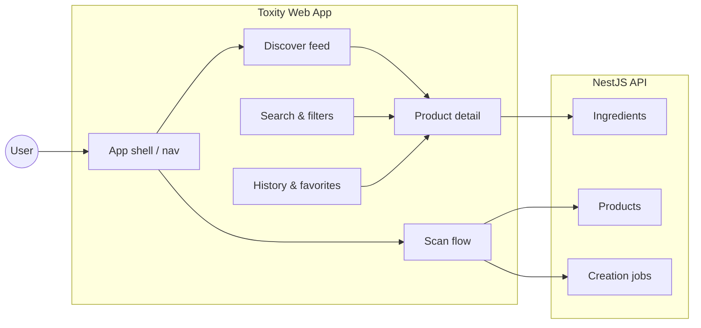
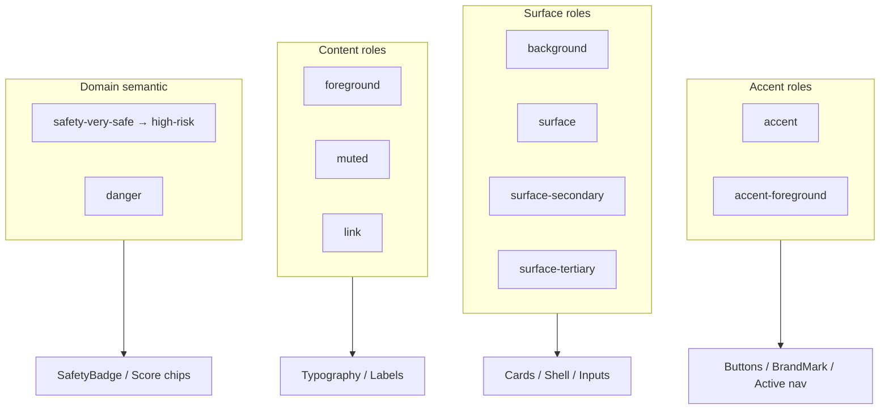

# Toxity — Design Document

| Field | Value |
|-------|-------|
| **Document type** | UI/UX & visual design system (Google-style design doc) |
| **Product** | Toxity — AI-Powered Product Ingredient Intelligence Platform |
| **Status** | Draft |
| **Version** | 1.0 |
| **Last updated** | 2026-07-01 |
| **Related docs** | [PRODUCT.md](PRODUCT.md) · [Architecture](plan/directions/02-system-architecture.md) · [Domain model](plan/directions/03-domain-model.md) |

---

## Purpose

This document describes the **visual design system, interaction patterns, and UI architecture** for Toxity’s web application. By the end of this document, readers should understand why the interface looks and behaves the way it does, what trade-offs were made, and how to extend the system consistently.

**Audience:** Product, design, frontend engineering, and QA.

**Living document:** Update when tokens, components, or flows change. Log material changes in [Changelog](#changelog).

---

## 1. Context and scope

### Background

Toxity is a **mobile-first** ingredient intelligence app. The primary logged-in experience uses a **fixed bottom navigation bar** (Home, Scan, Search, History, Profile) so users can scan and navigate one-handed in-store. Users scan barcodes or photograph labels, then read AI-generated safety analysis at product and ingredient level. The UI must communicate **trust, clarity, and calm urgency** — users often make purchase decisions under time pressure.

The frontend is **React 19 + Tailwind CSS v4** with CSS-variable design tokens in `app/src/index.css`. Components live in `app/src/components/` (layout, ui, brand, providers). This doc does not duplicate API or data-model specs; see [PRODUCT.md](PRODUCT.md) and [API design](plan/directions/04-api-design.md).

### What this document covers

- Brand voice and design principles
- Token-based color, typography, shape, and elevation systems (Material Design 3–inspired)
- Information architecture and navigation
- Component specifications and screen patterns
- Accessibility, responsiveness, and motion
- Alternatives considered and implementation map

### What this document does not cover

- Backend architecture, AI prompts, or OCR pipeline (see architecture docs)
- Marketing landing page (separate surface; may share tokens)
- Native Android UI (future; same token semantics expected)

### System context



---

## 2. Goals and non-goals

### Goals

| ID | Goal |
|----|------|
| G1 | **Mobile-first clarity** — Primary tasks (scan, read safety, search) achievable one-handed on 375px width via **bottom navigation** |
| G2 | **Accessible safety communication** — Color bands always paired with text; WCAG 2.1 AA contrast targets |
| G3 | **Token-driven consistency** — All colors, type, and radius from CSS variables; no hardcoded hex in components |
| G4 | **Trustworthy aesthetic** — Calm, clinical, science-forward; not alarmist or gamified |
| G5 | **Theme parity** — Light and dark modes with equivalent readability and safety distinguishability |
| G6 | **Composable components** — Tailwind primitives in `components/ui/`; compose via props and `cn()`, not third-party UI kits |
| G7 | **Bottom nav shell** — Five-tab bar fixed on mobile; Scan always one tap away |

### Non-goals

| ID | Non-goal | Rationale |
|----|----------|-----------|
| NG1 | Pixel-perfect parity with Material Design 3 components | Web stack uses custom Tailwind primitives; we adopt M3 *token semantics*, not M3 widgets |
| NG2 | Highly illustrative or playful consumer branding | Product context is health/safety; tone stays restrained |
| NG3 | Custom icon set in MVP | Lucide icons suffice; brand mark is the primary custom visual |
| NG4 | Motion-heavy marketing animations | Performance and clarity over delight-first motion |
| NG5 | Per-user dynamic theming from wallpaper/photo | Static brand palette for MVP |

---

## 3. Design principles

| Principle | Application |
|-----------|-------------|
| **Safety is never color-only** | Every `color_indicator` renders as `SafetyBadge` with dot + label |
| **Scan is always reachable** | Dedicated **Scan** tab in bottom nav; center or emphasized; `scan` button variant on Home |
| **Progressive disclosure** | Product summary → ingredient accordions → full ingredient detail |
| **Honest uncertainty** | `UNKNOWN` band styled neutrally; confidence called out when low |
| **Calm hierarchy** | One accent (sage green); safety spectrum reserved for data semantics |
| **Density adapts** | Comfortable spacing on mobile; sidebar + multi-column on desktop |

### Brand voice (UI copy)

- **Plain language** — “Moderate risk” not “Score 12/20”
- **Informative, not prescriptive** — “May irritate sensitive skin” not “Do not buy”
- **Encouraging empty states** — “Scan your first product” with clear next step

---

## 4. Overview

Toxity’s design system has three layers, aligned with [Material Design 3 theming](https://developer.android.com/develop/ui/compose/designsystems/material3):

1. **Reference tokens** — Raw values (`--brand-hue`, OKLCH safety colors)
2. **System tokens** — Semantic roles (`--accent`, `--surface`, `--foreground`, `--safety-*`)
3. **Component tokens** — Tailwind theme aliases (`bg-surface`, `text-muted`, `SafetyBadge` styles)

**Visual identity:** Sage green accent on neutral surfaces, Outfit headings, Source Sans 3 body, rounded-xl surfaces, shield-based `BrandMark`.

**Navigation model:** **Mobile-first app shell** with fixed **bottom navigation** on `< lg`: **Home · Scan · Search · History · Profile**. Content scrolls in a main pane above the nav; Scan is visually primary. On desktop (`≥ lg`), the same five destinations appear in an adaptive layout (sidebar or top bar) — bottom nav remains the reference IA. Current codebase still uses a CRM sidebar placeholder until Feature 02 ships.

See [Feature 02 app shell](plan/tasks/feature-02-app-shell/01-app-shell-navigation.md).

---

## 5. Detailed design

### 5.1 Color system

#### 5.1.1 Brand palette

Source hue: `--brand-hue: 158` (sage green). OKLCH used for perceptual uniformity across light/dark themes.

| Role | CSS variable | Usage |
|------|--------------|-------|
| Background | `--background` | Page canvas |
| Foreground | `--foreground` | Primary text |
| Muted | `--muted` | Secondary text, placeholders |
| Accent | `--accent` | Primary CTA, links, active nav, brand mark |
| Accent foreground | `--accent-foreground` | Text/icons on accent |
| Danger | `--danger` | Destructive actions (logout, delete) |
| Border | `--border` | Dividers, card outlines |
| Surface | `--surface` | Cards, header, sidebar |
| Surface secondary | `--surface-secondary` | Hover states, skeletons |
| Surface tertiary | `--surface-tertiary` | Nested panels |
| Field | `--field-background`, `--field-border` | Inputs |

Themes: `[data-theme="dark"]` (default) and `[data-theme="light"]` on `<html>`.

#### 5.1.2 Safety spectrum (domain semantic colors)

Maps to `ColorIndicator` enum in domain model. **Not** used for general UI chrome.

| Indicator | Token | Label | Meaning |
|-----------|-------|-------|---------|
| `VERY_SAFE` | `--safety-very-safe` | Very safe | Minimal concern for typical use |
| `SAFE` | `--safety-safe` | Safe | Generally acceptable |
| `MODERATE` | `--safety-moderate` | Moderate | Some concerns; context matters |
| `CAUTION` | `--safety-caution` | Caution | Notable risks for some users |
| `HIGH_RISK` | `--safety-high-risk` | High risk | Strong concerns |
| `UNKNOWN` | `--safety-unknown` | Unknown | Insufficient data |

**Implementation:** `app/src/components/ui/safety-badge.tsx` — pill with colored dot + text, tinted background, inset border.

**Rule:** Never convey safety level by color alone (WCAG + product trust).

#### 5.1.3 Color role diagram (M3-inspired)



---

### 5.2 Typography

#### 5.2.1 Font families

| Role | Family | Variable |
|------|--------|----------|
| Body | Source Sans 3 | `--sans` |
| Headings | Outfit | `--heading` |
| Monospace | ui-monospace | `--mono` (barcodes, IDs) |

Loaded via Google Fonts in `index.css`.

#### 5.2.2 Type scale (Material Design 3 mapping)

Toxity uses a simplified M3 scale. Map as follows when adding styles:

| M3 role | Toxity usage | Size / weight (web) |
|---------|--------------|---------------------|
| `displaySmall` | Marketing hero (future) | 2.25rem / 600 |
| `headlineMedium` | Page title (e.g. Discover) | 1.5rem / 600 |
| `headlineSmall` | Section headers | 1.25rem / 600 |
| `titleLarge` | Card titles, product names | 1.125rem / 600 |
| `titleMedium` | Subsection labels | 1rem / 600 |
| `titleSmall` | Nav labels | 0.8125rem / 500 |
| `bodyLarge` | Lead paragraphs | 1rem / 400 |
| `bodyMedium` | Default body | 0.875rem / 400 |
| `bodySmall` | Captions, metadata | 0.75rem / 400 |
| `labelLarge` | Buttons | 0.875rem / 500–600 |
| `labelSmall` | Badges, overlines | 0.6875rem / 600, uppercase for overlines |

**Base:** `16px / 150%` on `:root`. Headings use `letter-spacing: -0.02em`.

---

### 5.3 Shape and elevation

#### Radius tokens

| Token | Value | Usage |
|-------|-------|-------|
| `--radius-sm` | 0.5rem | Small chips |
| `--radius-md` | 0.75rem | Inputs |
| `--radius-lg` | 1rem | Default cards |
| `--radius-xl` | 1.25rem | Buttons, sidebar, modals |

#### Elevation

Prefer **border + subtle shadow** over heavy drop shadows.

- Cards: light border + `shadow-sm` equivalent
- Sidebar / dashboard header: layered `color-mix` shadow with accent-tinted ring
- Scan CTA: accent glow via `shadow` on `scan` button variant

---

### 5.4 Layout and information architecture

#### Mobile-first shell (canonical)

The consumer app is **mobile-first**. Logged-in users on phone and tablet get a **fixed bottom navigation bar** — not hamburger-only navigation.

| Tab | Label | Role |
|-----|-------|------|
| 1 | Home | Discovery feed, continue scanning |
| 2 | Scan | Barcode / OCR (primary action) |
| 3 | Search | Find products, ingredients, brands |
| 4 | History | Past scans |
| 5 | Profile | Account, preferences, favorites |

**Layout rules (mobile):**

- Bottom nav height ~56–64px + `env(safe-area-inset-bottom)`
- Main content: `padding-bottom` clears fixed nav
- Active tab: accent color + label; inactive: muted
- Scan tab: optional center elevation / larger icon (emphasized)
- No duplicate primary nav patterns on mobile (no sidebar + bottom nav together)

#### Breakpoints (Tailwind defaults)

| Breakpoint | Layout behavior |
|------------|-----------------|
| `< lg` (mobile/tablet) | Single column; **fixed bottom nav**; optional compact top bar (title + theme) |
| `≥ lg` (desktop) | Same five destinations; sidebar or top nav; bottom nav hidden |

#### Mobile layout (target)

```
┌─────────────────────────────┐
│  Top bar (title, theme)     │  optional, minimal
├─────────────────────────────┤
│                             │
│  Main content (scroll)      │
│  Home / Scan / Search / …   │
│                             │
├─────────────────────────────┤
│ Home │ Scan │ Search │ … │ Profile │  ← fixed bottom nav
└─────────────────────────────┘
```

#### Desktop layout (adaptive)

```
┌──────────┬──────────────────────────────────┐
│ Side nav │  Main content                      │
│ (5 items)│  Same routes as mobile tabs        │
└──────────┴──────────────────────────────────┘
```

*Interim:* CRM `Sidebar` exists until `app-shell.tsx` + `bottom-nav.tsx` land (Feature 02).

#### Navigation items (implementation status)

| Item | Route (planned) | Mobile tab | Status |
|------|-----------------|------------|--------|
| Home | `Routes.home.root` (TBD) | ✓ | Placeholder → `dashboard` |
| Scan | TBD | ✓ | Coming soon |
| Search | TBD | ✓ | Coming soon |
| History | TBD | ✓ | Coming soon |
| Profile | TBD | ✓ | Coming soon |

---

### 5.5 Component library

#### Brand

| Component | Path | Spec |
|-----------|------|------|
| `BrandMark` | `components/brand/brand-mark.tsx` | Shield icon in gradient rounded square + “Toxity” wordmark; sizes `sm` / `md` / `lg` |

#### Layout

| Component | Path | Spec |
|-----------|------|------|
| `Navbar` | `components/layout/navbar.tsx` | Auth/marketing header; BrandMark + theme toggle |
| `Sidebar` | `components/layout/sidebar.tsx` | Collapsible; persists state in `localStorage` |
| `SidebarContent` | `components/layout/sidebar-content.tsx` | Nav links + “Coming soon” section |
| `DashboardNavbar` | `components/layout/dashboard-navbar.tsx` | Page title + subtitle + theme + user menu |
| `UserMenuPopover` | `components/layout/user-menu-popover.tsx` | Profile, Preferences, Log out |
| `BottomNav` | `components/layout/bottom-nav.tsx` | **Planned (Feature 02)** — fixed mobile bar: Home, Scan, Search, History, Profile |
| `AppShell` | `components/layout/app-shell.tsx` | **Planned (Feature 02)** — outlet + bottom nav + safe-area insets |

#### UI primitives

> Implementation checklist for agents: [`docs/plan/directions/05-frontend-ui-primitives.md`](plan/directions/05-frontend-ui-primitives.md) — **reuse** these files; do not recreate styles per page.

| Component | Path | Variants / notes |
|-----------|------|------------------|
| `Button` | `components/ui/button.tsx` | `default`, `outline`, `ghost`, **`scan`** (primary + glow) |
| `Card` | `components/ui/card.tsx` | `rounded-xl`, border, subtle shadow |
| `Input` | `components/ui/input.tsx` | `rounded-xl`, focus ring accent |
| `SafetyBadge` | `components/ui/safety-badge.tsx` | `compact` option for inline lists |
| `Toast`, `Drawer`, `Popover` | `components/ui/*` | Plain Tailwind + minimal React state |

#### Button variant guide

| Variant | When to use |
|---------|-------------|
| `scan` | Primary scan actions, FAB-equivalent |
| `default` | Standard submit / confirm |
| `outline` | Secondary actions |
| `ghost` | Tertiary / toolbar icons |

---

### 5.6 Key screens and patterns

#### Discover (home)

- Welcome card with value prop + **Scan product** CTA (`variant="scan"`)
- Feed sections: Continue scanning, Trending, Top rated, Categories (card grid)
- Skeleton placeholders until API wired

#### Product detail (planned)

```
┌─────────────────────────────┐
│ [Hero image]                │
│ Product name                │
│ Brand · Category            │
│ SafetyBadge (overall)       │
│ Score 0–20 (secondary)      │
├─────────────────────────────┤
│ AI summary (body)           │
│ Benefits | Risks | Warnings │
├─────────────────────────────┤
│ Ingredients ▼               │
│  1. Water          SAFE     │
│  2. Fragrance      CAUTION  │
│  ... accordion rows         │
└─────────────────────────────┘
```

- Ingredient rows: name + `SafetyBadge` compact; expand for full AI fields
- Pregnancy / child / sensitive skin: icon + text chips, not color-only

#### Scan flow (planned)

1. Camera viewfinder + barcode overlay
2. Found → product detail
3. Not found → capture ingredient label → optional front label → progress steps (`PENDING` → `OCR` → `ANALYZING` → `COMPLETED`)
4. Error state with retake guidance

#### Search (planned)

- Sticky search field; filters as horizontal chips
- Results: product cards with thumbnail, name, brand, `SafetyBadge`

#### Empty states

| Context | Message pattern |
|---------|-----------------|
| No scan history | “No scans yet” + Scan CTA |
| No favorites | “Save products you want to track” |
| Search no results | “Try a different term or scan the label” |

---

### 5.7 Motion and interaction

| Interaction | Duration | Easing |
|-------------|----------|--------|
| Hover / focus | 150–200ms | ease |
| Sidebar collapse | 300ms | ease-in-out |
| Nav icon scale | 200ms | default |
| Skeleton pulse | Tailwind `animate-pulse` | — |
| Page transitions | None in MVP | Avoid layout shift |

**Non-goals:** Parallax, celebratory confetti, score animations that imply game-like scoring.

---

## 6. Alternatives considered

| Alternative | Trade-off | Decision |
|-------------|-----------|----------|
| **Red/amber primary brand** | Strong “danger” association; conflicts with safety spectrum | Rejected — sage green accent |
| **Score-only UI (single number)** | Faster scan but opaque; fails depth value prop | Rejected — badge + score + accordions |
| **Material UI component library** | Faster bootstrapping; heavier bundle; less brand control | Rejected — plain Tailwind CSS primitives |
| **Inter / Roboto typography** | Familiar but generic | Rejected — Outfit + Source Sans 3 |
| **CSS `class="dark"` on html** | Tailwind convention | Using `data-theme` for explicit light/dark tokens |
| **Bottom tab bar on desktop** | Good on mobile; wasteful on wide screens | **Accepted** — bottom nav on `< lg` only; desktop uses side/top nav |
| **FAB-only Scan (no bottom nav tab)** | Saves bar space | Rejected — Scan must stay in bottom nav per product IA |
| **Hamburger-only mobile nav** | Saves vertical space | Rejected — hides Scan and core sections behind menu |

---

## 7. Cross-cutting concerns

### 7.1 Accessibility

| Requirement | Implementation |
|-------------|----------------|
| Color contrast | OKLCH tokens tuned for 4.5:1+ on body text |
| Safety colors | Always paired with text in `SafetyBadge` |
| Focus | `focus-visible:ring-2 ring-accent/45` on interactive elements |
| Touch targets | Min 44×44px on bottom nav items and mobile CTAs |
| Screen readers | `aria-label` on icon-only buttons; accordion `aria-expanded` |
| Motion | Respect `prefers-reduced-motion` (to add globally) |

### 7.2 Responsiveness

- Mobile-first utility classes
- `overflow: hidden` on body for app-shell scroll containment; main pane scrolls
- Collapsible sidebar persisted per device

### 7.3 Performance

- System fonts fallback in font stack
- No heavy animation libraries in MVP
- Lazy-load camera scanner module when Scan ships

### 7.4 Privacy & trust UI

- No dark patterns on data collection
- Disclaimer footer on product detail (legal copy TBD)
- `PENDING` verification badge on unapproved community products

### 7.5 Internationalization

- Copy externalized over time; `preferred_language` on user profile
- Safety labels must translate; color semantics stay consistent

---

## 8. Implementation map

| Concern | Source of truth |
|---------|-----------------|
| Design tokens | `app/src/index.css` |
| Theme toggle | `app/src/hooks/use-theme.ts`, `components/providers/theme-provider.tsx` |
| Brand | `app/src/components/brand/brand-mark.tsx` |
| Safety UI | `app/src/components/ui/safety-badge.tsx` |
| Routes (no hardcoded URLs) | `app/src/routes/routes.ts` |
| Page patterns | `app/src/pages/*` |
| Product requirements | `docs/PRODUCT.md` |

### Token change checklist

1. Update CSS variables in `index.css` (light + dark)
2. Verify `@theme inline` aliases if adding new Tailwind colors
3. Update `SafetyBadge` if safety spectrum changes
4. Snapshot Discover + product detail in both themes
5. Log change in this doc’s Changelog

---

## 9. Testing and acceptance

### Visual acceptance (MVP shell)

- [ ] BrandMark renders in navbar and sidebar (collapsed + expanded)
- [ ] Light/dark toggle updates all surfaces without contrast failures
- [ ] `SafetyBadge` distinct for all six indicators in both themes
- [ ] `scan` button visually primary vs `default` / `outline`
- [ ] Sidebar collapse persists across reload
- [ ] Mobile: dashboard usable at 375px width

### Accessibility checks

- [ ] Keyboard navigation through sidebar and user menu
- [ ] Focus ring visible on all interactive elements
- [ ] Safety badges readable in high-contrast mode / Windows contrast themes (spot check)

### Future screen acceptance (when built)

- [ ] Product detail accordion keyboard accessible
- [ ] Scan flow camera permissions and error states
- [ ] OCR job progress steps match backend statuses

---

## 10. Open questions

| # | Question | Owner | Status |
|---|----------|-------|--------|
| D1 | Bottom nav vs FAB for Scan on mobile? | Design | **Resolved — bottom nav** (Scan tab) |
| D2 | Show numeric 0–20 score alongside badge or hide by default? | Product | Open |
| D3 | Product card thumbnail aspect ratio? | Design | Open |
| D4 | Admin UI: separate shell or role-gated routes in same app? | Engineering | Open |
| D5 | `prefers-reduced-motion` global CSS — when to add? | Frontend | Open |
| D6 | Scan tab center elevation vs equal five tabs? | Design | Open |

---

## 11. References

- [Google design docs (structure)](https://www.industrialempathy.com/posts/design-docs-at-google/)
- [Material Design 3 — theming](https://developer.android.com/develop/ui/compose/designsystems/material3)
- [Material Design 3 — color roles & tokens](https://developer.android.com/codelabs/m3-design-theming)
- [WCAG 2.1 — use of color](https://www.w3.org/WAI/WCAG21/Understanding/use-of-color.html)
- [Toxity PRODUCT.md](PRODUCT.md)

---

## Changelog

| Version | Date | Changes |
|---------|------|---------|
| 1.0 | 2026-07-01 | Initial design doc: tokens, components, IA, M3 mapping, accessibility |
| 1.1 | 2026-07-01 | Mobile-first shell; bottom navigation (Home, Scan, Search, History, Profile) |
