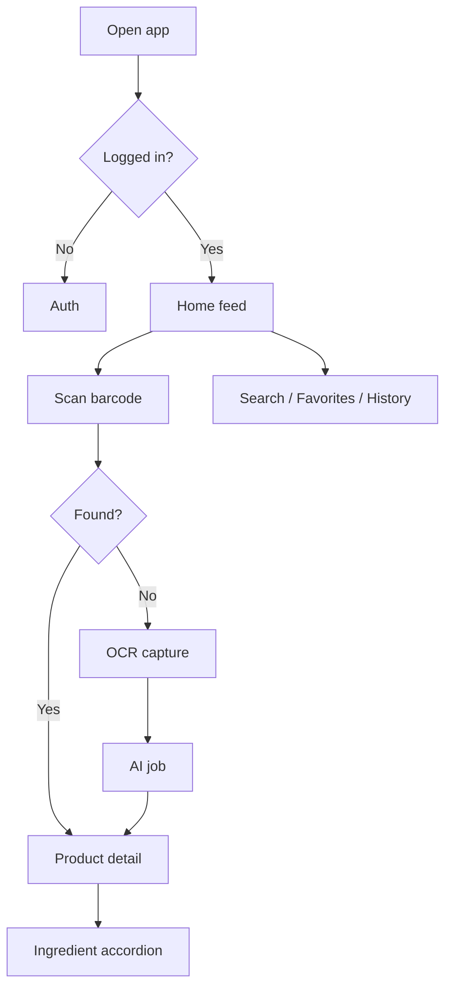

# Toxity — Product Requirements Document

| Field | Value |
|-------|-------|
| **Product** | Toxity — AI-Powered Product Ingredient Intelligence Platform |
| **Status** | Draft |
| **Version** | 1.0 |
| **Last updated** | 2026-07-01 |
| **Source spec** | [`docs/plan/directions/01-product-spec.md`](plan/directions/01-product-spec.md) |
| **Related docs** | [DESIGN.md](DESIGN.md) · [Architecture](plan/directions/02-system-architecture.md) · [Domain model](plan/directions/03-domain-model.md) · [API design](plan/directions/04-api-design.md) |

---

## TL;DR

Toxity helps health-conscious consumers scan packaged products (cosmetics, food, supplements, cleaning, pet, baby, healthcare) and understand every ingredient through AI-generated analysis. Users contribute to a **shared global product database** — each product is analyzed once and reused by everyone. Unlike simple safety-score apps, Toxity delivers deep per-product and per-ingredient insights (benefits, risks, suitability, environmental impact, alternatives) backed by a single improving global record. **MVP is a mobile-first web app** with **persistent bottom navigation** (Home, Scan, Search, History, Profile); desktop is a responsive adaptation of the same shell. Native Android follows.

---

## 1. Document metadata & contacts

| Role | Responsibility |
|------|----------------|
| Product owner | Defines scope, success metrics, prioritization |
| Engineering | API, AI pipeline, data model, web app |
| Design | Mobile-first UX, safety color system, scan flows |
| QA | MVP acceptance criteria (Section 9) |

**Living document:** Update this PRD when discovery changes scope, metrics, or assumptions. Log material changes in [Changelog](#changelog).

---

## 2. Positioning statement (Geoffrey Moore)

> **For** health-conscious consumers, parents, and shoppers with allergies or dietary restrictions  
> **who** need to understand what is inside packaged products before they buy,  
> **Toxity** is an **AI-powered ingredient intelligence platform**  
> **that** turns a barcode scan or label photo into clear, actionable safety and suitability guidance.  
> **Unlike** simple safety-score apps and static ingredient lists,  
> **Toxity** provides comprehensive AI analysis per product and per ingredient, stores one global record per product, and improves that record for every future user.

### Value proposition

| Pillar | User outcome |
|--------|----------------|
| **Scan → understand** | Barcode lookup or OCR label capture yields full product + ingredient breakdown in seconds |
| **Analyze once, reuse forever** | Community-contributed global DB; no duplicate analysis waste |
| **Depth over score** | Benefits, risks, pregnancy/child suitability, vegan/cruelty-free, environmental impact, alternatives |
| **Trust through transparency** | Color-coded safety bands, confidence scores, references, admin verification |

### Product category

Consumer health & product transparency — ingredient intelligence / barcode scanner with AI analysis.

### Primary competitive alternatives

| Alternative | Limitation Toxity addresses |
|-------------|----------------------------|
| Generic barcode apps (Open Food Facts, Yuka-style) | Often shallow scores; limited per-ingredient AI depth |
| Reading labels manually | Slow, jargon-heavy, no personalized suitability context |
| Google search per ingredient | Fragmented, inconsistent, no product-level synthesis |
| Doing nothing | Unknown exposure to allergens, irritants, or undesired substances |

---

## 3. Problem statement

### The problem

Packaged product labels are dense, inconsistent, and written for regulators—not consumers. Shoppers cannot quickly answer:

- Is this safe for my child, pregnancy, or sensitive skin?
- Does it contain allergens or ingredients I avoid (vegan, cruelty-free, etc.)?
- What does this chemical name actually do, and what is the risk level?
- Is there a better alternative?

Existing apps often reduce complexity to a single opaque score without explaining *why*, and they re-analyze or duplicate data instead of building a shared, improving knowledge base.

### Who feels this pain

| Persona | Context | Job to be done |
|---------|---------|----------------|
| **Health-conscious shopper** | In-store or online | Quickly decide buy / skip based on ingredient safety |
| **Parent** | Baby & children products | Verify products are appropriate for kids |
| **Allergy / sensitivity sufferer** | Cosmetics, food, cleaning | Avoid triggers; check cross-contamination risk |
| **Ethical shopper** | Beauty, food | Confirm vegan, cruelty-free, environmental claims |
| **Research-oriented user** | At home | Deep-dive ingredients, save favorites, compare products |

### Why now

- AI can structure reliable ingredient analysis at scale.
- Camera + barcode on mobile web is production-ready.
- Consumers expect transparency similar to nutrition apps, extended to full ingredient intelligence across categories.

---

## 4. Objectives & success metrics

### Objectives (SMART, MVP)

| # | Objective | Target (90 days post-MVP GA) |
|---|-----------|------------------------------|
| O1 | Activate users through scan | ≥ 40% of registered users complete ≥ 1 scan |
| O2 | Deliver value on first scan | ≥ 70% of barcode lookups return an existing product with full detail |
| O3 | Grow shared database | ≥ 500 unique products in global DB (mix of seed + user-created) |
| O4 | Retain engaged users | ≥ 25% of week-1 scanners return in week 4 |
| O5 | Admin quality | ≥ 95% of user-submitted products reviewed within 72 hours |

### Primary metric

**Weekly active scanners (WAS)** — unique users who complete ≥ 1 product scan (barcode or OCR) per week.

### Secondary metrics

| Metric | Definition |
|--------|------------|
| Scan-to-detail completion | % scans that reach product detail view |
| Unknown barcode → create rate | % of 404 barcode lookups that start OCR creation flow |
| Creation success rate | % OCR jobs that complete with approved product |
| Favorites per active user | Avg favorites (product + ingredient + brand) |
| Home feed CTR | Clicks from discovery sections to product detail |

### Guardrail metrics (must not regress)

| Guardrail | Threshold |
|-----------|-----------|
| Product detail P95 load time | < 2.5s on 4G |
| OCR job failure rate | < 15% |
| Auth error rate | < 0.5% of login attempts |
| AI analysis user-reported inaccuracy | Tracked; target < 5% of views (future feedback) |

### Measurement window

Evaluate O1–O5 at **30, 60, and 90 days** post-MVP launch.

---

## 5. Target users & personas

### Persona A — Maya, the mindful parent

- **Demographics:** 32, parent of toddler, urban, mobile-first
- **Goals:** Avoid harsh chemicals in baby care; quick in-aisle decisions
- **Frustrations:** Tiny labels, misleading “natural” marketing
- **Toxity moment:** Scans baby lotion barcode → sees child-safety band + flagged fragrance allergens

### Persona B — James, the allergy-aware shopper

- **Demographics:** 28, nut and fragrance sensitivities
- **Goals:** Confirm food and cosmetics are safe before purchase
- **Frustrations:** Apps that only score, don’t explain cross-contamination
- **Toxity moment:** Searches ingredient “limonene” → reads AI risk summary → checks scan history

### Persona C — Priya, the ethical beauty buyer

- **Demographics:** 26, vegan, cruelty-free priority
- **Goals:** Validate brand claims; discover better alternatives
- **Frustrations:** Greenwashing; incomplete brand data
- **Toxity moment:** Favorites a brand → browses top-rated vegan skincare on home feed

### Persona D — Admin reviewer

- **Role:** Internal moderator
- **Goals:** Keep global DB accurate; merge duplicates; re-trigger AI when models improve
- **Toxity moment:** Approves pending product, merges duplicate barcode entries, queues reanalysis

---

## 6. User stories & jobs-to-be-done

### Authentication & profile

| ID | As a… | I want to… | So that… |
|----|--------|------------|----------|
| U1 | New user | Register with email and verify | My account is secure and recoverable |
| U2 | Returning user | Log in and reset forgotten password | I can access my history and favorites |
| U3 | User | Set profile preferences (country, language, theme) | Content and UI match my context |

### Scan & product lookup

| ID | As a… | I want to… | So that… |
|----|--------|------------|----------|
| U4 | Shopper | Scan a barcode with my camera | I instantly see if the product exists in Toxity |
| U5 | Shopper | View full product detail with ingredient accordions | I understand overall safety and each ingredient |
| U6 | Shopper | Capture label photos when barcode is unknown | The product is created and analyzed for everyone |
| U7 | Shopper | See overall score and color safety band | I grasp risk at a glance before reading details |

### Discovery & search

| ID | As a… | I want to… | So that… |
|----|--------|------------|----------|
| U8 | User | Browse home feeds (recent, trending, top-rated, categories) | I discover products without scanning |
| U9 | User | Search by name, brand, ingredient, category | I find products and ingredients directly |
| U10 | User | Filter results | I narrow to relevant categories or safety levels |

### Personal library

| ID | As a… | I want to… | So that… |
|----|--------|------------|----------|
| U11 | User | See my scan history | I can reopen products I checked before |
| U12 | User | Favorite products, ingredients, and brands | I build a personal watchlist |

### Admin

| ID | As a… | I want to… | So that… |
|----|--------|------------|----------|
| U13 | Admin | Review and approve/reject new products | Only quality data enters the global DB |
| U14 | Admin | Merge duplicate products | One canonical record per product |
| U15 | Admin | Manage taxonomy and trigger AI reanalysis | Data stays organized and up to date |

---

## 7. Scope

### In scope (MVP)

| Area | Capability |
|------|------------|
| **Auth** | Email register/login, forgot password, email verification, user profile |
| **Scan** | Barcode scan → lookup; OCR label capture for new products |
| **Products** | Global product DB, AI analysis, overall score, color indicator |
| **Ingredients** | Global ingredient DB, per-ingredient AI analysis & color rating |
| **Taxonomy** | Category → Subcategory hierarchy; brand database |
| **Discovery** | Home feed: recent, trending, top-rated, categories, spotlight |
| **Search** | Barcode, name, brand, ingredient, category; filters |
| **History** | User scan history (references global products) |
| **Favorites** | Favorite products, ingredients, brands |
| **Admin** | Review/approve, merge duplicates, manage taxonomy, trigger AI reanalysis |
| **Platforms** | Mobile web (primary), desktop web (responsive) |
| **App shell** | Mobile-first; **bottom navigation** on phone/tablet — Home, Scan, Search, History, Profile |

### Out of scope (MVP — future)

| Item | Notes |
|------|-------|
| Product reviews & community ratings | Post-MVP social layer |
| Ingredient discussions | Community feature |
| Report incorrect info / suggest edits | Community moderation |
| Native Android app | Ship responsive web / PWA first |
| AI Chat on product detail | Placeholder UI acceptable |

### Non-goals (explicit)

- Medical diagnosis or prescription advice
- Replacing regulatory compliance workflows for manufacturers
- Real-time inventory or pricing comparison

---

## 8. Functional requirements

### 8.1 Authentication

- FR-A1: Email + password registration with bcrypt hashing
- FR-A2: JWT access token with refresh token flow
- FR-A3: Email verification via time-limited token
- FR-A4: Password reset via email link
- FR-A5: Profile fields: name, avatar, country, preferred_language, theme, notification_settings

### 8.2 Barcode scan & lookup

- FR-S1: Camera-based barcode scanning on supported mobile browsers
- FR-S2: `GET /products/barcode/:barcode` — return full product or 404
- FR-S3: On successful lookup, record `UserProductScan` with method `BARCODE`
- FR-S4: Navigate to product detail on hit

### 8.3 Product creation (OCR pipeline)

- FR-P1: Multi-step job: upload ingredient label → optional front label → analyze
- FR-P2: Server-side OCR (Google Cloud Vision or equivalent)
- FR-P3: AI pipeline creates/links ingredients, generates product + ingredient analysis
- FR-P4: Job statuses: `PENDING` → `OCR` → `ANALYZING` → `COMPLETED` | `FAILED`
- FR-P5: New products default to `verification_status: PENDING` until admin approval

### 8.4 Product & ingredient detail

- FR-D1: Product detail includes ordered ingredients, images, scores, AI summaries, FAQ, similar products
- FR-D2: Ingredient detail includes safety enums, scores, color_indicator, references
- FR-D3: Color indicators: `VERY_SAFE` | `SAFE` | `MODERATE` | `CAUTION` | `HIGH_RISK` | `UNKNOWN`
- FR-D4: Overall product score on 0–20 scale mapped to color bands

### 8.5 Discovery & search

- FR-H1: Home sections backed by real API data (recent, trending, top-rated, categories, spotlight)
- FR-H2: Full-text search across products, ingredients, brands (PostgreSQL FTS initially)
- FR-H3: Filters: category, subcategory, brand, safety band, vegan, cruelty-free

### 8.6 User library

- FR-L1: Paginated scan history, most recent first
- FR-L2: Polymorphic favorites: `PRODUCT` | `INGREDIENT` | `BRAND`
- FR-L3: `is_favorited` flag on relevant detail responses

### 8.7 Admin

- FR-AD1: Role-gated routes (`ADMIN`) for product review queue
- FR-AD2: Approve, reject, merge duplicate products
- FR-AD3: CRUD taxonomy (categories, subcategories, brands)
- FR-AD4: Trigger AI reanalysis; store `ProductAnalysisVersion` / `IngredientAnalysisVersion` audit trail

---

## 9. Non-functional requirements

| Category | Requirement |
|----------|-------------|
| **Performance** | Product detail P95 < 2.5s; home feed P95 < 3s; barcode lookup P95 < 1s (cached) |
| **Availability** | 99.5% API uptime (staging/production) |
| **Security** | JWT on all user routes; bcrypt passwords; no secrets in client; HTTPS only |
| **Privacy** | GDPR-ready data export/delete (roadmap); minimal PII in logs |
| **Accessibility** | WCAG 2.1 AA target: color bands paired with text labels; focus states; 44px touch targets on mobile |
| **Localization** | `preferred_language` on profile; i18n-ready copy (English MVP) |
| **Mobile-first** | Primary layout 375px; **bottom nav** for main sections; Scan tab in thumb zone; content scrolls above fixed nav |
| **AI quality** | Structured JSON outputs; `ai_version` + `confidence_score` on records; admin reanalysis path |
| **Data integrity** | One global row per product (unique barcode); one row per ingredient name; dedup merges |

---

## 10. UX & design principles

### Design intent

Toxity should feel **trustworthy, calm, and clinical without being cold** — like a knowledgeable friend who explains science plainly. **Mobile-first:** the logged-in experience is built around a fixed **bottom navigation bar** so Scan and other core actions stay one tap away. See [DESIGN.md](DESIGN.md) for shell layout and component specs.

### App shell (mobile-first)

| Tab | Purpose |
|-----|---------|
| **Home** | Discovery feed (recent, trending, top-rated, categories) |
| **Scan** | Barcode camera + OCR creation entry (primary action) |
| **Search** | Products, ingredients, brands, filters |
| **History** | User scan history |
| **Profile** | Account, preferences, favorites access |

On viewports `≥ lg`, the same five destinations remain available via an adaptive layout (e.g. side nav or top bar); **bottom nav is the canonical mobile pattern** and must not be replaced by a hamburger-only IA on small screens.

### Visual identity (implementation: `app/src/index.css`)

| Token | Usage |
|-------|--------|
| **Reagent amber accent** | Primary actions, links, brand mark — decoupled from the neutral (ink) hue |
| **Safety spectrum** | `VERY_SAFE` → `HIGH_RISK` semantic colors (always paired with text) |
| **Neutral surfaces** | Layered cards for product detail and ingredient accordions |
| **Typography** | IBM Plex Sans (headings + body) + IBM Plex Mono (scores, barcodes, data labels) |

**UI implementation rule:** Reuse shared primitives from `app/src/components/ui/` (`Button`, `Input`, `Card`, `SafetyBadge`, etc.) — do not recreate the same Tailwind styles on every screen. See [`docs/plan/directions/05-frontend-ui-primitives.md`](plan/directions/05-frontend-ui-primitives.md) and [`DESIGN.md`](DESIGN.md) §5.5.

### Key flows

### UX requirements

- UX-1: Safety color never appears without text label (e.g. “Moderate risk”)
- UX-2: Logged-in mobile layout uses **fixed bottom navigation** with five tabs; Scan is always visible (center or emphasized tab)
- UX-3: Main content area scrolls independently; bottom nav does not obscure primary CTAs (safe-area padding)
- UX-4: Async data uses **skeleton placeholders** that mirror final layout — never bare `"Loading..."` labels or full-page spinners; OCR/AI jobs show named progress steps (e.g. "Analyzing ingredients…")
- UX-5: Empty states educate (e.g. “Scan your first product”)
- UX-6: Dark and light themes via `data-theme` attribute

---

## 11. Data model summary

Global entities: **Category**, **Subcategory**, **Brand**, **Ingredient**, **Product**, **ProductIngredient**, **ProductImage**.

User-scoped: **User** (extended profile), **UserProductScan**, **UserFavorite**.

Transient: **ProductCreationJob** for OCR/AI pipeline.

See [Domain model](plan/directions/03-domain-model.md) for full field definitions and indexes.

---

## 12. Assumptions

| ID | Assumption | Risk if wrong |
|----|------------|---------------|
| A1 | Users will contribute label photos for unknown products | DB growth stalls → need seed data / partnerships |
| A2 | OpenAI structured outputs are sufficient for ingredient analysis | Quality issues → human review load increases |
| A3 | Mobile web camera APIs work on majority of target devices | Fallback manual barcode entry required |
| A4 | Admin team can review pending products within 72h | Backlog hurts trust |
| A5 | Single global product record per barcode is acceptable legally | Regional formulation differences may need variant model |

---

## 13. Dependencies & integrations

| Dependency | Purpose |
|------------|---------|
| PostgreSQL + Prisma | Primary datastore |
| Redis | Cache (home feeds, lookups) |
| OpenAI | Product & ingredient analysis |
| Google Cloud Vision (or equivalent) | Label OCR |
| Google Cloud Storage | Product/label images |
| Resend / SendGrid | Verification & password emails |

---

## 14. Risks & mitigations

| Risk | Impact | Mitigation |
|------|--------|------------|
| AI hallucination in safety text | High — user harm, trust loss | Confidence scores, admin review, references, disclaimers |
| Duplicate products in global DB | Medium — fragmented data | Merge tooling, barcode uniqueness, name+brand dedup |
| OCR failure on poor photos | Medium — failed creates | Capture guidance UI, retake step, manual ingredient entry (future) |
| Regulatory perception as medical device | High | Clear “informational only” disclaimer; no diagnostic claims |
| Slow AI pipeline | Medium — drop-off | Async jobs, progress UI, push/email when done (future) |

---

## 15. MVP acceptance criteria

1. User registers, verifies email, logs in, sets profile preferences.
2. User scans a known barcode → sees full product detail with ingredient accordions.
3. User scans unknown barcode → captures label images → AI creates product → detail page opens.
4. User sees scan history, favorites, and home discovery feeds from real data.
5. Admin can review, merge duplicates, and re-trigger AI analysis.

---

## 16. Release & milestones

| Phase | Deliverable | Outcome |
|-------|-------------|---------|
| M1 | Auth + profile + app shell | Users can sign in; navigation matches IA |
| M2 | Taxonomy + ingredients backend | Categories, brands, ingredient records |
| M3 | Products + barcode lookup | Known product scan works end-to-end |
| M4 | OCR creation pipeline | Unknown products enter global DB |
| M5 | Discovery + search + history + favorites | Engagement loops complete |
| M6 | Admin tools + polish | Quality gate and MVP acceptance |

*Estimates are directional, not contractual. Prioritize outcomes per milestone.*

---

## 17. Open questions

| # | Question | Owner | Due |
|---|----------|-------|-----|
| Q1 | Regional product variants (same barcode, different formulations)? | Product | Before scale |
| Q2 | Disclaimer copy and legal review for health-adjacent claims? | Legal/Product | Pre-GA |
| Q3 | Minimum ingredient confidence to show without “uncertain” badge? | Product/AI | M4 |
| Q4 | PWA install prompt vs native Android priority? | Product | Post-MVP |
| Q5 | Elasticsearch migration trigger (search volume threshold)? | Engineering | Post-MVP |

---

## 18. Glossary

| Term | Definition |
|------|------------|
| **Global product** | Single canonical `Product` row shared by all users |
| **Color indicator** | Semantic safety band derived from scores |
| **Scan** | User action recorded in `UserProductScan` |
| **Creation job** | Async OCR + AI pipeline for new products |
| **Verification** | Admin approval state before product is fully public |

---

## Changelog

| Version | Date | Changes |
|---------|------|---------|
| 1.0 | 2026-07-01 | Initial PRD from product spec; Google-style structure with positioning, metrics, scope, NFRs |
| 1.1 | 2026-07-01 | Mobile-first app shell with bottom navigation (Home, Scan, Search, History, Profile) |
