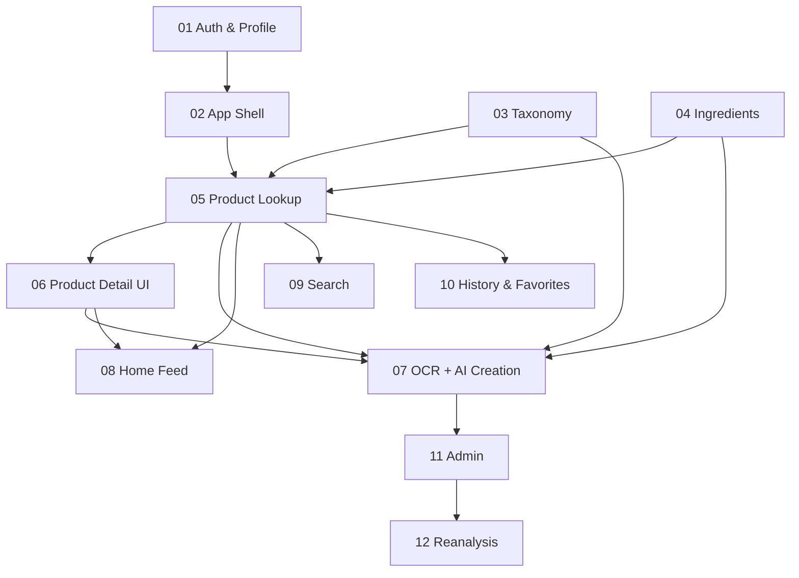

# Project Progress Tracker — Toxity

> **For AI coding agents:** Read this file at the start of every session.
> Use the **Current focus** section and feature checklists to decide what
> to implement next. Open the **References** paths for the active feature
> before writing code. Update this file when deliverables are verified.

**Last updated:** 2026-07-01  
**Overall progress:** ~5% (0 / 12 features complete; Feature 01 partially started)  
**Current focus:** Feature 01 — Authentication & User Profile → `tasks/feature-01-auth/01-auth-backend-extend.md`

**Source spec:** [`docs/specifications.md`](../../specifications.md)

### Canonical documentation

| Doc | Path | Use when |
|-----|------|----------|
| Product requirements (full PRD) | [`../PRODUCT.md`](../PRODUCT.md) | Scope, metrics, user stories, MVP acceptance |
| Design system (UI/UX) | [`../DESIGN.md`](../DESIGN.md) | **Mobile-first bottom nav**, tokens, components, layouts, accessibility |

Direction docs in `directions/` are summaries; **`PRODUCT.md` and `DESIGN.md` take precedence** on product scope and visual design.

---

## Session start checklist

- [ ] Read this file (`PROGRESS.md`)
- [ ] Skim [`../PRODUCT.md`](../PRODUCT.md) and [`../DESIGN.md`](../DESIGN.md) when scope or UI is in scope
- [ ] Read direction docs listed under **Current focus** feature
- [ ] Open the next incomplete task file in that feature group
- [ ] Implement until acceptance criteria pass
- [ ] Update checklists and percentages below
- [ ] Set **Current focus** to the next incomplete item

---

## Existing codebase baseline

| Area | Status |
|------|--------|
| Email register/login API | ✅ Partial (`POST /auth/email/register`, `login`) |
| Auth UI (sign-in, sign-up) | ✅ Partial |
| JWT guards, Prisma User model | ✅ Exists |
| Refresh / forgot / verify | ❌ Not implemented |
| User profile API | ❌ Not implemented |
| Product / Ingredient / Scan | ❌ Not implemented |
| Consumer app shell (bottom nav) | ❌ CRM dashboard placeholder remains |
| Planning docs | ✅ `docs/plan/` created |

**Cleanup note:** Remove CRM lead placeholders, Appointly branding, and stale Elasticsearch Lead/Contact references when touching related files.

---

## Feature index

| # | Feature | Status | Progress | Task files |
|---|---------|--------|----------|------------|
| 01 | Authentication & User Profile | in progress | ~25% | 2 |
| 02 | App Shell & Navigation | not started | 0% | 1 |
| 03 | Taxonomy Foundation | not started | 0% | 1 |
| 04 | Ingredient Library | not started | 0% | 2 |
| 05 | Product Lookup (Existing Product) | not started | 0% | 2 |
| 06 | Product Detail UI | not started | 0% | 1 |
| 07 | New Product Creation (OCR + AI) | not started | 0% | 3 |
| 08 | Home & Discovery | not started | 0% | 2 |
| 09 | Search | not started | 0% | 1 |
| 10 | History & Favorites | not started | 0% | 2 |
| 11 | Admin Panel | not started | 0% | 1 |
| 12 | AI Reanalysis | not started | 0% | 1 |

**Progress method:** Feature % = completed checklist items / total checklist items. Overall % = average of feature percentages.

---

## Feature 01: Authentication & User Profile

**Description:** Users can register, sign in, verify email, reset password, and manage profile settings.

**Status:** in progress  
**Progress:** ~25%

### References

| Doc | Path |
|-----|------|
| Product spec | `directions/01-product-spec.md` |
| System architecture | `directions/02-system-architecture.md` |
| Domain model | `directions/03-domain-model.md` |
| API design | `directions/04-api-design.md` |

### Task files

| File | Status |
|------|--------|
| `tasks/feature-01-auth/01-auth-backend-extend.md` | not started |
| `tasks/feature-01-auth/02-auth-frontend-profile.md` | not started |

### Implementation checklist

- [x] Database schema / User model (basic — exists)
- [x] Backend: register endpoint
- [x] Backend: login endpoint + JWT
- [ ] Extended User fields (name, avatar, country, language, theme, notifications)
- [ ] Backend: refresh token endpoint
- [ ] Backend: forgot / reset password
- [ ] Backend: email verification
- [ ] Backend: `GET/PATCH /users/me`, avatar upload
- [x] Frontend: sign-up page wired to API
- [x] Frontend: sign-in page wired to API
- [ ] Frontend: forgot / reset / verify pages
- [ ] Frontend: token refresh in axios interceptor
- [ ] Frontend: profile settings page
- [ ] Smoke test: full auth + profile flow

**Definition of done:** User can register, verify email, reset password, update profile (theme, language, avatar), and stay logged in via refresh.

---

## Feature 02: App Shell & Navigation

**Description:** Mobile-first app with bottom navigation: Home, Scan, Search, History, Profile.

**Status:** not started  
**Progress:** 0%

### References

| Doc | Path |
|-----|------|
| Product spec | `directions/01-product-spec.md` |
| Design system (bottom nav) | [`../DESIGN.md`](../DESIGN.md) |
| System architecture | `directions/02-system-architecture.md` |

### Task files

| File | Status |
|------|--------|
| `tasks/feature-02-app-shell/01-app-shell-navigation.md` | not started |

### Implementation checklist

- [ ] Bottom navigation component
- [ ] App shell layout replacing CRM sidebar
- [ ] Routes: home, scan, search, history, profile
- [ ] Protected routes use app shell
- [ ] Post-login redirect to home
- [ ] Remove CRM dashboard placeholders
- [ ] Smoke test: navigate all 5 tabs while logged in

**Definition of done:** Logged-in user sees bottom nav and can reach all five main sections.

---

## Feature 03: Taxonomy Foundation

**Description:** Global categories, subcategories, and brands with seed data and read APIs.

**Status:** not started  
**Progress:** 0%

### References

| Doc | Path |
|-----|------|
| Domain model | `directions/03-domain-model.md` |
| API design | `directions/04-api-design.md` |

### Task files

| File | Status |
|------|--------|
| `tasks/feature-03-taxonomy/01-taxonomy-backend.md` | not started |

### Implementation checklist

- [ ] Category, Subcategory, Brand Prisma models
- [ ] Seed script with spec category tree
- [ ] `GET /categories` tree endpoint
- [ ] `GET /brands` list/search endpoint
- [ ] Smoke test: categories API returns Beauty, Food, etc.

**Definition of done:** API returns full category hierarchy from seeded data.

---

## Feature 04: Ingredient Library

**Description:** Global ingredient database with detail page and safety color indicators.

**Status:** not started  
**Progress:** 0%

### References

| Doc | Path |
|-----|------|
| Domain model | `directions/03-domain-model.md` |
| API design | `directions/04-api-design.md` |
| Product spec | `directions/01-product-spec.md` |

### Task files

| File | Status |
|------|--------|
| `tasks/feature-04-ingredients/01-ingredients-backend.md` | not started |
| `tasks/feature-04-ingredients/02-ingredients-frontend.md` | not started |

### Implementation checklist

- [ ] Ingredient Prisma model + enums
- [ ] Ingredient list/detail API
- [ ] Seed common ingredients
- [ ] Frontend ingredient detail page
- [ ] Color indicator UI component
- [ ] Smoke test: view ingredient detail in browser

**Definition of done:** User can open an ingredient detail page with full AI analysis fields and color rating.

---

## Feature 05: Product Lookup (Existing Product)

**Description:** Scan barcode → find global product → record scan history.

**Status:** not started  
**Progress:** 0%

### References

| Doc | Path |
|-----|------|
| Domain model | `directions/03-domain-model.md` |
| API design | `directions/04-api-design.md` |

### Task files

| File | Status |
|------|--------|
| `tasks/feature-05-product-lookup/01-products-backend.md` | not started |
| `tasks/feature-05-product-lookup/02-barcode-scan-frontend.md` | not started |

### Implementation checklist

- [ ] Product, ProductIngredient, ProductImage, UserProductScan models
- [ ] Barcode lookup + product detail API
- [ ] Scans API (create + list)
- [ ] Seed sample products with barcodes
- [ ] Barcode scanner UI on Scan tab
- [ ] Navigate to product detail on hit; creation flow on miss
- [ ] Smoke test: scan seeded barcode → product opens → history updated

**Definition of done:** User scans a known barcode and lands on product detail; scan appears in history.

---

## Feature 06: Product Detail UI

**Description:** Full product page with hero, score, summary, ingredient accordions.

**Status:** not started  
**Progress:** 0%

### References

| Doc | Path |
|-----|------|
| Product spec | `directions/01-product-spec.md` |
| API design | `directions/04-api-design.md` |

### Task files

| File | Status |
|------|--------|
| `tasks/feature-06-product-detail/01-product-detail-ui.md` | not started |

### Implementation checklist

- [ ] Product detail page route
- [ ] Hero + score badge
- [ ] Summary section (benefits, risks, warnings)
- [ ] Ingredient accordion list with expand/collapse
- [ ] Link to ingredient detail
- [ ] Responsive layout per spec
- [ ] Smoke test: full product browsing experience

**Definition of done:** Product detail matches spec layout with working ingredient accordions.

---

## Feature 07: New Product Creation (OCR + AI)

**Description:** Unknown barcode → capture labels → OCR → AI analysis → new global product.

**Status:** not started  
**Progress:** 0%

### References

| Doc | Path |
|-----|------|
| Product spec | `directions/01-product-spec.md` |
| System architecture | `directions/02-system-architecture.md` |
| API design | `directions/04-api-design.md` |

### Task files

| File | Status |
|------|--------|
| `tasks/feature-07-product-creation/01-ocr-jobs-backend.md` | not started |
| `tasks/feature-07-product-creation/02-ai-analysis-pipeline.md` | not started |
| `tasks/feature-07-product-creation/03-creation-flow-frontend.md` | not started |

### Implementation checklist

- [ ] OCR integration module
- [ ] ProductCreationJob model + upload endpoints
- [ ] BullMQ AI analysis processor
- [ ] Ingredient/category/brand reuse logic
- [ ] Product + ingredient creation from AI output
- [ ] Multi-step creation UI with progress polling
- [ ] Smoke test: create new product from photos end-to-end

**Definition of done:** User scans unknown product, captures labels, waits for AI, and views new product detail.

---

## Feature 08: Home & Discovery

**Description:** Home feed with trending, top-rated, categories, spotlight, daily tip.

**Status:** not started  
**Progress:** 0%

### References

| Doc | Path |
|-----|------|
| Product spec | `directions/01-product-spec.md` |
| API design | `directions/04-api-design.md` |

### Task files

| File | Status |
|------|--------|
| `tasks/feature-08-home/01-home-feed-backend.md` | not started |
| `tasks/feature-08-home/02-home-screen-frontend.md` | not started |

### Implementation checklist

- [ ] `GET /home` aggregated endpoint
- [ ] Redis caching for feed sections
- [ ] Home UI with all sections
- [ ] Reusable product card component
- [ ] Smoke test: home shows real product data

**Definition of done:** Home tab displays live feeds from database including user's recent scans.

---

## Feature 09: Search

**Description:** Search products, ingredients, brands with sort and category filters.

**Status:** not started  
**Progress:** 0%

### References

| Doc | Path |
|-----|------|
| API design | `directions/04-api-design.md` |

### Task files

| File | Status |
|------|--------|
| `tasks/feature-09-search/01-search-fullstack.md` | not started |

### Implementation checklist

- [ ] Unified search API
- [ ] Search page UI with filters
- [ ] Barcode quick match
- [ ] Smoke test: search finds products and ingredients

**Definition of done:** User can search by name, ingredient, or barcode and open results.

---

## Feature 10: History & Favorites

**Description:** Scan history tab and favorites for products, ingredients, brands.

**Status:** not started  
**Progress:** 0%

### References

| Doc | Path |
|-----|------|
| Domain model | `directions/03-domain-model.md` |
| API design | `directions/04-api-design.md` |

### Task files

| File | Status |
|------|--------|
| `tasks/feature-10-history-favorites/01-history-ui.md` | not started |
| `tasks/feature-10-history-favorites/02-favorites-fullstack.md` | not started |

### Implementation checklist

- [ ] History page with paginated scans
- [ ] UserFavorite model + API
- [ ] Favorite toggle on detail pages
- [ ] Profile favorites lists
- [ ] Smoke test: favorite and view history

**Definition of done:** User sees scan history and can favorite/unfavorite products and ingredients.

---

## Feature 11: Admin Panel

**Description:** Admins review products, manage taxonomy, merge duplicates, feature products.

**Status:** not started  
**Progress:** 0%

### References

| Doc | Path |
|-----|------|
| Product spec | `directions/01-product-spec.md` |
| API design | `directions/04-api-design.md` |

### Task files

| File | Status |
|------|--------|
| `tasks/feature-11-admin/01-admin-moderation.md` | not started |

### Implementation checklist

- [ ] Admin API routes with RolesGuard
- [ ] Pending product review
- [ ] Merge products/ingredients/brands
- [ ] Category admin CRUD
- [ ] Admin UI at `/admin`
- [ ] Smoke test: admin approves pending product

**Definition of done:** Admin can approve products and merge duplicates from admin UI.

---

## Feature 12: AI Reanalysis

**Description:** Admins trigger AI reanalysis with version history audit trail.

**Status:** not started  
**Progress:** 0%

### References

| Doc | Path |
|-----|------|
| Product spec | `directions/01-product-spec.md` |
| Domain model | `directions/03-domain-model.md` |

### Task files

| File | Status |
|------|--------|
| `tasks/feature-12-reanalysis/01-reanalysis-versioning.md` | not started |

### Implementation checklist

- [ ] Analysis version tables
- [ ] Reanalysis job processors
- [ ] Admin reanalyze endpoints
- [ ] Version history API + admin UI
- [ ] Smoke test: reanalysis preserves history

**Definition of done:** Admin reanalyzes a product; scores update; previous version stored.

---

## Implementation phases (dependency order)

---

## Notes

- Direction docs (`directions/`) are reference only — they do not count toward implementation %.
- Full product and design specs: [`../PRODUCT.md`](../PRODUCT.md), [`../DESIGN.md`](../DESIGN.md).
- Prefer vertical slices: finish Feature 05 + 06 before heavy investment in Feature 08.
- Feature 07 is the largest slice — allocate 3 task files as scoped.
- Community features (reviews, reports) are post-MVP per spec.
- Android native app shares API; ship responsive web + PWA first.
