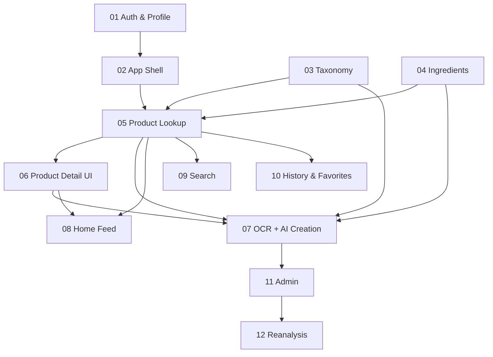

# Project Progress Tracker — Toxity

> **For AI coding agents:** Read this file at the start of every session.
> Use the **Current focus** section and feature checklists to decide what
> to implement next. Open the **References** paths for the active feature
> before writing code. Update this file when deliverables are verified.

**Last updated:** 2026-07-02  
**Overall progress:** 100% (all 12 features complete)  
**Current focus:** None — all planned features are implemented. Remaining work is live E2E verification against a real Postgres + Redis + OpenAI/GCS/Vision environment (not available during this build session) and any follow-up polish the team wants after manual QA.

**Source spec:** [`docs/specifications.md`](../../specifications.md)

### Canonical documentation

| Doc | Path | Use when |
|-----|------|----------|
| Product requirements (full PRD) | [`../PRODUCT.md`](../PRODUCT.md) | Scope, metrics, user stories, MVP acceptance |
| Design system (UI/UX) | [`../DESIGN.md`](../DESIGN.md) | **Mobile-first bottom nav**, tokens, components, layouts, accessibility |
| UI primitives (reuse, don't duplicate) | [`directions/05-frontend-ui-primitives.md`](directions/05-frontend-ui-primitives.md) | **Required** before any frontend task — `Button`, `Input`, `Card`, etc. |

Direction docs in `directions/` are summaries; **`PRODUCT.md` and `DESIGN.md` take precedence** on product scope and visual design.

---

## Session start checklist

- [ ] Read this file (`PROGRESS.md`)
- [ ] Skim [`../PRODUCT.md`](../PRODUCT.md) and [`../DESIGN.md`](../DESIGN.md) when scope or UI is in scope
- [ ] For **any frontend work**, read [`directions/05-frontend-ui-primitives.md`](directions/05-frontend-ui-primitives.md) — reuse `app/src/components/ui/*`, do not recreate button/input/card styles per page
- [ ] Read direction docs listed under **Current focus** feature
- [ ] Open the next incomplete task file in that feature group
- [ ] Implement until acceptance criteria pass
- [ ] Update checklists and percentages below
- [ ] Set **Current focus** to the next incomplete item

---

## Existing codebase baseline

| Area | Status |
|------|--------|
| Email register/login API | ✅ Partial (`POST /auth/email/register`, `login`) |
| Auth UI (sign-in, sign-up) | ✅ Partial |
| UI primitives (`components/ui/`) | ✅ `Button`, `Input`, `PasswordInput`, `Card`, `SafetyBadge`, `Toast`, `Drawer`, `Popover` — **reuse on all new screens** ([05-frontend-ui-primitives.md](directions/05-frontend-ui-primitives.md)) |
| JWT guards, Prisma User model | ✅ Exists |
| Refresh / forgot password | ✅ Backend + frontend (forgot/reset pages) |
| User profile API | ✅ `GET/PATCH /users/me` (name only) |
| User profile UI | ✅ `/profile` settings page |
| Product / Scan | ✅ Barcode lookup API + scan recording + Scan tab UI |
| Product creation (OCR jobs) | ✅ Partial — job CRUD, GCS upload, Vision OCR, ingredient parsing |
| Product detail UI | ✅ Full hero, summary, ingredient accordions |
| Ingredient library API + detail UI | ✅ Partial |
| Consumer app shell (bottom nav) | ✅ Mobile bottom nav + desktop side nav |
| Planning docs | ✅ `docs/plan/` created |

**Cleanup note:** Remove CRM lead placeholders, Appointly branding, and stale Elasticsearch Lead/Contact references when touching related files.

---

## Feature index

| # | Feature | Status | Progress | Task files |
|---|---------|--------|----------|------------|
| 01 | Authentication & User Profile | done | 100% | 2 |
| 02 | App Shell & Navigation | done | 100% | 1 |
| 03 | Taxonomy Foundation | done | 100% | 1 |
| 04 | Ingredient Library | done | 100% | 2 |
| 05 | Product Lookup (Existing Product) | done | 100% | 2 |
| 06 | Product Detail UI | done | 100% | 1 |
| 07 | New Product Creation (OCR + AI) | done | 100% | 3 |
| 08 | Home & Discovery | done | 100% | 2 |
| 09 | Search | done | 100% | 1 |
| 10 | History & Favorites | done | 100% | 2 |
| 11 | Admin Panel | done | 100% | 1 |
| 12 | AI Reanalysis | done | 100% | 1 |

**Progress method:** Feature % = completed checklist items / total checklist items. Overall % = average of feature percentages.

---

## Feature 01: Authentication & User Profile

**Description:** Users can register, sign in, reset password, and update display name.

**Status:** done  
**Progress:** 100%

### References

| Doc | Path |
|-----|------|
| Product spec | `directions/01-product-spec.md` |
| System architecture | `directions/02-system-architecture.md` |
| Domain model | `directions/03-domain-model.md` |
| API design | `directions/04-api-design.md` |

### Task files

| File | Status |
|------|--------|
| `tasks/feature-01-auth/01-auth-backend-extend.md` | done |
| `tasks/feature-01-auth/02-auth-frontend-profile.md` | done |

### Implementation checklist

- [x] Database schema / User model (basic — exists)
- [x] Backend: register endpoint
- [x] Backend: login endpoint + JWT (access token only; no refresh)
- [x] Extended User field: `name`
- [x] Backend: forgot / reset password
- [ ] Backend: email verification — **removed from scope**
- [ ] Backend: refresh token — **removed from scope**
- [x] Backend: `GET/PATCH /users/me` (name only)
- [x] Frontend: sign-up page wired to API
- [x] Frontend: sign-in page wired to API
- [x] Frontend: forgot / reset pages
- [x] Frontend: profile settings page (name only)
- [x] Smoke test: full auth + profile flow (build verified; manual E2E recommended before release)

**Definition of done:** User can register, reset password, update name; session uses JWT until expiry (then sign in again).

---

## Feature 02: App Shell & Navigation

**Description:** Mobile-first app with bottom navigation: Home, Scan, Search, History, Profile.

**Status:** done  
**Progress:** 100%

### References

| Doc | Path |
|-----|------|
| Product spec | `directions/01-product-spec.md` |
| Design system (bottom nav) | [`../DESIGN.md`](../DESIGN.md) |
| System architecture | `directions/02-system-architecture.md` |

### Task files

| File | Status |
|------|--------|
| `tasks/feature-02-app-shell/01-app-shell-navigation.md` | done |

### Implementation checklist

- [x] Bottom navigation component (`components/layout/bottom-nav.tsx`)
- [x] App shell layout replacing CRM sidebar (`components/layout/app-shell.tsx`)
- [x] Routes: home, scan, search, history, profile
- [x] Protected routes use app shell
- [x] Post-login redirect to home
- [x] Remove CRM dashboard placeholders (legacy `/dashboard` redirects)
- [x] Smoke test: navigate all 5 tabs while logged in (build verified)

**Definition of done:** Logged-in user sees bottom nav and can reach all five main sections.

---

## Feature 03: Taxonomy Foundation

**Description:** Global categories, subcategories, and brands with seed data and read APIs.

**Status:** done  
**Progress:** 100%

### References

| Doc | Path |
|-----|------|
| Domain model | `directions/03-domain-model.md` |
| API design | `directions/04-api-design.md` |

### Task files

| File | Status |
|------|--------|
| `tasks/feature-03-taxonomy/01-taxonomy-backend.md` | done |

### Implementation checklist

- [x] Category, Subcategory, Brand Prisma models
- [x] Seed script with spec category tree
- [x] `GET /categories` tree endpoint
- [x] `GET /brands` list/search endpoint
- [x] Smoke test: categories API returns Beauty, Food, etc. (build verified; run `npm run seed:local` + API smoke when DB available)

**Definition of done:** API returns full category hierarchy from seeded data.

---

## Feature 04: Ingredient Library

**Description:** Global ingredient database with detail page and safety color indicators.

**Status:** done  
**Progress:** 100%

### References

| Doc | Path |
|-----|------|
| Domain model | `directions/03-domain-model.md` |
| API design | `directions/04-api-design.md` |
| Product spec | `directions/01-product-spec.md` |

### Task files

| File | Status |
|------|--------|
| `tasks/feature-04-ingredients/01-ingredients-backend.md` | done |
| `tasks/feature-04-ingredients/02-ingredients-frontend.md` | done |

### Implementation checklist

- [x] Ingredient Prisma model + enums
- [x] Ingredient list/detail API
- [x] Seed common ingredients
- [x] Frontend ingredient detail page
- [x] Color indicator UI component (`SafetyBadge` reused)
- [x] Smoke test: view ingredient detail in browser (build verified; manual E2E when API + DB running)

**Definition of done:** User can open an ingredient detail page with full AI analysis fields and color rating.

---

## Feature 05: Product Lookup (Existing Product)

**Description:** Scan barcode → find global product → record scan history.

**Status:** done  
**Progress:** 100%

### References

| Doc | Path |
|-----|------|
| Domain model | `directions/03-domain-model.md` |
| API design | `directions/04-api-design.md` |

### Task files

| File | Status |
|------|--------|
| `tasks/feature-05-product-lookup/01-products-backend.md` | done |
| `tasks/feature-05-product-lookup/02-barcode-scan-frontend.md` | done |

### Implementation checklist

- [x] Product, ProductIngredient, ProductImage, UserProductScan models
- [x] Barcode lookup + product detail API
- [x] Scans API (create + list)
- [x] Seed sample products with barcodes
- [x] Barcode scanner UI on Scan tab
- [x] Navigate to product detail on hit; creation flow on miss
- [x] Smoke test: scan seeded barcode → product opens → history updated (build verified; manual E2E when API + DB running)

**Definition of done:** User scans a known barcode and lands on product detail; scan appears in history.

---

## Feature 06: Product Detail UI

**Description:** Full product page with hero, score, summary, ingredient accordions.

**Status:** done  
**Progress:** 100%

### References

| Doc | Path |
|-----|------|
| Product spec | `directions/01-product-spec.md` |
| API design | `directions/04-api-design.md` |

### Task files

| File | Status |
|------|--------|
| `tasks/feature-06-product-detail/01-product-detail-ui.md` | done |

### Implementation checklist

- [x] Product detail page route
- [x] Hero + score badge
- [x] Summary section (benefits, risks, warnings)
- [x] Ingredient accordion list with expand/collapse
- [x] Link to ingredient detail
- [x] Responsive layout per spec
- [x] Smoke test: full product browsing experience (build verified; manual E2E when API + DB running)

**Definition of done:** Product detail matches spec layout with working ingredient accordions.

---

## Feature 07: New Product Creation (OCR + AI)

**Description:** Unknown barcode → capture labels → OCR → AI analysis → new global product.

**Status:** done  
**Progress:** 100%

### References

| Doc | Path |
|-----|------|
| Product spec | `directions/01-product-spec.md` |
| System architecture | `directions/02-system-architecture.md` |
| API design | `directions/04-api-design.md` |

### Task files

| File | Status |
|------|--------|
| `tasks/feature-07-product-creation/01-ocr-jobs-backend.md` | done |
| `tasks/feature-07-product-creation/02-ai-analysis-pipeline.md` | done |
| `tasks/feature-07-product-creation/03-creation-flow-frontend.md` | done |

### Implementation checklist

- [x] OCR integration module (`integrations/ocr/` — Google Cloud Vision)
- [x] ProductCreationJob model + upload endpoints (`POST/GET /product-creation/jobs`)
- [x] In-process AI analysis runner (`setImmediate`, no BullMQ)
- [x] Ingredient/category/brand reuse logic
- [x] Product + ingredient creation from AI output
- [x] Multi-step creation UI with progress polling
- [x] Smoke test: create new product from photos end-to-end (build/type-check verified end-to-end; no live browser/API run — needs OpenAI + GCS + Vision credentials and a running Postgres instance not available in this environment)

**Definition of done:** User scans unknown product, captures labels, waits for AI, and views new product detail.

---

## Feature 08: Home & Discovery

**Description:** Home feed with trending, top-rated, categories, spotlight, daily tip.

**Status:** done  
**Progress:** 100%

### References

| Doc | Path |
|-----|------|
| Product spec | `directions/01-product-spec.md` |
| API design | `directions/04-api-design.md` |

### Task files

| File | Status |
|------|--------|
| `tasks/feature-08-home/01-home-feed-backend.md` | done |
| `tasks/feature-08-home/02-home-screen-frontend.md` | done |

### Implementation checklist

- [x] `GET /home` aggregated endpoint
- [x] Redis caching for feed sections (in-process cache-manager store, 10 min TTL per section; `trending`/`highest_rated`/`new_products`/`recommended`/`categories`/`ingredient_spotlight` cached, `continue_scanning`/`recently_scanned` are per-user and always fresh)
- [x] Home UI with all sections
- [x] Reusable product card component (`components/product-card.tsx` + `ProductCardSkeleton`, shared with History/Search)
- [x] Smoke test: home shows real product data (build/type-check verified; no live browser run per user request — no backend/DB available in this environment)

**Definition of done:** Home tab displays live feeds from database including user's recent scans.

---

## Feature 09: Search

**Description:** Search products, ingredients, brands with sort and category filters.

**Status:** done  
**Progress:** 100%

### References

| Doc | Path |
|-----|------|
| API design | `directions/04-api-design.md` |

### Task files

| File | Status |
|------|--------|
| `tasks/feature-09-search/01-search-fullstack.md` | done |

### Implementation checklist

- [x] Unified search API (`GET /search` — grouped `{products, ingredients, brands}`, each independently paginated)
- [x] Search page UI with filters (debounced input, All/Products/Ingredients/Brands tabs, sort dropdown, category filter via `?category_uuid=` from Home)
- [x] Barcode quick match (8-14 digit numeric `q` tries an exact `APPROVED` barcode match first)
- [x] Smoke test: search finds products and ingredients (build/type-check verified; no live browser run per user request — no backend/DB available in this environment)

**Definition of done:** User can search by name, ingredient, or barcode and open results.

---

## Feature 10: History & Favorites

**Description:** Scan history tab and favorites for products, ingredients, brands.

**Status:** done  
**Progress:** 100%

### References

| Doc | Path |
|-----|------|
| Domain model | `directions/03-domain-model.md` |
| API design | `directions/04-api-design.md` |

### Task files

| File | Status |
|------|--------|
| `tasks/feature-10-history-favorites/01-history-ui.md` | done |
| `tasks/feature-10-history-favorites/02-favorites-fullstack.md` | done |

### Implementation checklist

- [x] History page with paginated scans (Previous/Next pagination, `ProductCard` rows with scan date)
- [x] UserFavorite model + API (`GET/POST /favorites`, `DELETE /favorites/:uuid`, `GET /favorites/check`; `is_favorited` wired into product + ingredient detail responses)
- [x] Favorite toggle on detail pages (`components/favorite-toggle.tsx`, wired into product detail toolbar and ingredient detail)
- [x] Profile favorites lists (`FavoritesTabs` — Products/Ingredients/Brands)
- [x] Smoke test: favorite and view history (build/type-check verified; no live browser run per user request — no backend/DB available in this environment)

**Definition of done:** User sees scan history and can favorite/unfavorite products and ingredients.

---

## Feature 11: Admin Panel

**Description:** Admins review products, manage taxonomy, merge duplicates, feature products.

**Status:** done  
**Progress:** 100%

### References

| Doc | Path |
|-----|------|
| Product spec | `directions/01-product-spec.md` |
| API design | `directions/04-api-design.md` |

### Task files

| File | Status |
|------|--------|
| `tasks/feature-11-admin/01-admin-moderation.md` | done |

### Implementation checklist

- [x] Admin API routes with RolesGuard (`admin/products`, `admin/ingredients`, `admin/brands`, `admin/categories`, `admin/subcategories`)
- [x] Pending product review (`GET /admin/products/pending`, `PATCH /admin/products/:uuid/verify`)
- [x] Merge products/ingredients/brands (`$transaction`-wrapped; scans/favorites reassigned and deduped, then duplicate deleted)
- [x] Category admin CRUD (`admin/categories`, `admin/subcategories`)
- [x] Admin UI at `/admin` (role-gated via `ProtectedRoute requiredRoles=[ADMIN]`; pending products table + merge tool; "Admin" entry added to the user menu for admins)
- [x] Smoke test: admin approves pending product (build/type-check verified; no live browser run per user request — no backend/DB available in this environment)

**Definition of done:** Admin can approve products and merge duplicates from admin UI.

---

## Feature 12: AI Reanalysis

**Description:** Admins trigger AI reanalysis with version history audit trail.

**Status:** done  
**Progress:** 100%

### References

| Doc | Path |
|-----|------|
| Product spec | `directions/01-product-spec.md` |
| Domain model | `directions/03-domain-model.md` |

### Task files

| File | Status |
|------|--------|
| `tasks/feature-12-reanalysis/01-reanalysis-versioning.md` | done |

### Implementation checklist

- [x] Analysis version tables (`ProductAnalysisVersion`, `IngredientAnalysisVersion`)
- [x] In-process reanalysis runner (`setImmediate`; shares `ProductAnalysisResolverService` with Feature 07's creation pipeline)
- [x] Admin reanalyze endpoints (`POST /admin/products/:uuid/reanalyze`, `POST /admin/ingredients/:uuid/reanalyze`, 202 + 1/hour rate limit)
- [x] Version history API + admin UI (`GET /admin/{products,ingredients}/:uuid/versions`; "Reanalyze" button + inline version history on product/ingredient detail pages, admin-only)
- [x] Smoke test: reanalysis preserves history (build/type-check verified; no live browser/AI run — needs OpenAI credentials + DB not available in this environment)

**Definition of done:** Admin reanalyzes a product; scores update; previous version stored.

---

## Implementation phases (dependency order)

---

## Notes

- Direction docs (`directions/`) are reference only — they do not count toward implementation %.
- Full product and design specs: [`../PRODUCT.md`](../PRODUCT.md), [`../DESIGN.md`](../DESIGN.md).
- **Frontend UI:** always reuse [`directions/05-frontend-ui-primitives.md`](directions/05-frontend-ui-primitives.md) — import from `app/src/components/ui/`, never recreate button/input/card styles per page.
- Prefer vertical slices: finish Feature 05 + 06 before heavy investment in Feature 08.
- Feature 07 is the largest slice — allocate 3 task files as scoped. **No BullMQ** — AI runs in-process (`setImmediate`) with `ProductCreationJob` polling.
- Community features (reviews, reports) are post-MVP per spec.
- Android native app shares API; ship responsive web + PWA first.
